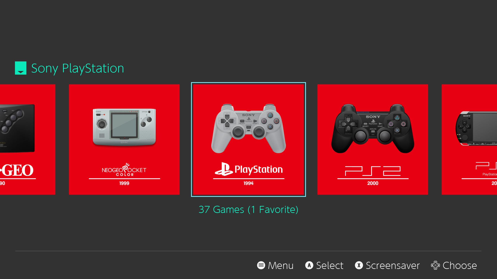

# es-de-moderntheme-nsoicons
 NSO-inspired icons for the Modern theme in EmulationStation Desktop Edition

These icons utilise resources from the ES-DE project as well as from the "NSO Interpreted" ES-DE theme to create an emulation experience reminiscent of a certain handheld console.

Screenshot:

To install, simply download the desired icons, and drop them into your ES-DE install folder/themes/modern-es-de/art.

I am currently working on a version of these icons for GarlicOS as well!
